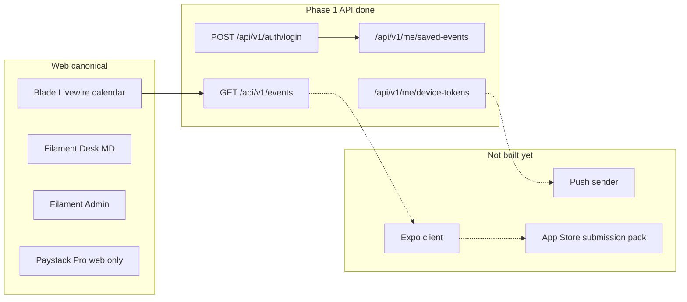

# App Store readiness audit — thin discovery iOS app

**Date:** 2026-09-21
**Status:** Audit only. No code changes in this pass. Backlog items
below are sequenced work to close **before** the first App Store
submission, not now.

## Goal

Record where the shootingsports platform stands against Apple App Store
requirements for the **first iOS release** that the native-apps
roadmap already locked in
([2026-09-17-native-apps-roadmap.md](2026-09-17-native-apps-roadmap.md)):
an Expo thin discovery client over the existing Sanctum `/api/v1`, no
Pro/Paystack, no in-app match registration, no MD desk, no social UGC.

The point is that Apple review itself is fast (Apple currently reports
&lt; 24 hours for ~90% of apps). What blows up the calendar is
submission prep — a rejection resets you by days. Land the Apple-facing
infrastructure on the **web + API first** so the Expo client only
consumes it, and submit-to-live stays a **1–3 day** window.

## Non-goals (v1 iOS)

- Selling Pro in the app (no IAP, no “Upgrade” CTA, no restore
  purchases).
- In-app match registration or payment. `entry_url` opens Safari and
  the platform stays out of the transaction. Terms §1 and §5 already
  say so.
- Match Director desk / staff admin. Filament stays on `web`.
- Social features (comments, chat, DMs, reviews, photo feeds).
- Firearm licence / competency / ID capture. Terms §15 already bans
  that on ordinary accounts and this must not regress.
- Universal links or Sign in with Apple. Both come later, not in v1.

## Current state snapshot

- **Phase 1 API is real and tested** in
  [`routes/api.php`](../../../routes/api.php): login/logout, events,
  disciplines, map, `/me`, saved events, Expo device-token storage.
  Pest coverage lives in `tests/Feature/ApiV1*.php`.
- **Match entry is third-party.** `Event.entry_url` opens Safari; the
  platform does not take entry fees. That is what keeps Apple’s IAP
  and “are you the merchant of record?” questions off the table.
- **UGC is listing-only** (MDs, staff, claims, submissions, media)
  with Filament moderation and `ModerationStatus` gating. No shooter
  posts, comments, chat, or photo feeds, so the Guideline 1.2 UGC
  report/block requirement barely applies to v1.
- **Legal URLs exist:** `/privacy`, `/terms`, `/contact`. Terms
  already disclaim organiser, dealer, and entry-processor roles.
- **Pro/Paystack is web-only** and roadmap keeps it out of the first
  client, so Guideline 3.1.1 (IAP for digital goods sold in-app) does
  not fire.
- **Push token storage** exists via `DeviceToken` and
  `/api/v1/me/device-tokens`; **no sender is wired**. Push is a
  Phase 3 problem, not an App Store v1 problem.

## Apple requirement vs current state

| Apple expects | Current state | Risk for thin first app |
|---|---|---|
| Fully functional native app (not a website wrapper) | Backend API ready, no Expo client | **Blocker until Phase 2.** Guideline 4.2 rejects thin WKWebView shells. Native Expo screens hitting `/api/v1` is the correct path. |
| No obvious crashes; complete metadata | No binary, no screenshots, no listing copy | Blocker until Phase 2 |
| Working Privacy / Terms / Support URLs | Pages exist; [`privacy.blade.php`](../../../resources/views/public/static/privacy.blade.php) still says *“a fuller POPIA notice will accompany user accounts in the next release”*; [`terms.blade.php`](../../../resources/views/public/static/terms.blade.php) marked *“Draft for public use — intended for attorney review”* | **High.** App Store Connect’s privacy questionnaire will not map cleanly to the current stub. |
| Demo account if login is required | None. `DatabaseSeeder` creates local staff (`admin@shootingsports.test`), not a reviewer shooter with saved events | **High.** Guideline 2.1 — every rejection I have seen for lack of a demo account costs 1–2 days. |
| In-app account deletion when the app uses accounts | Email `hello@shootingsports.co.za` only ([terms §17](../../../resources/views/public/static/terms.blade.php)) | **High.** Guideline 5.1.1(v) requires an in-app path even if signup stays on the web. |
| Public password reset | `password_reset_tokens` table exists but there is **no public web reset and no API reset** — Filament panels only | Medium. Reviewers and mobile-only users will get stuck. |
| IAP for digital subscriptions sold in-app | Paystack on web only; Pro excluded from v1 iOS | **None if we hold the line.** Do not add a Pro CTA in the iOS binary. |
| UGC report/block | Email report in terms; staff Filament moderation | Low for v1 (no social feed). Add an in-app “Report listing” only if shooter-authored content ever appears. |
| Sign in with Apple | No social login at all | None today. Only required if Google/Facebook login is added. |
| Functional push if advertised | Token storage only, no sender | Keep push **off the App Store listing** until Phase 3 is delivered. |
| Age / content rating | No age gate | Expect **17+**. Review Notes must be explicit that this is a sport calendar, not a game or a firearms marketplace. |
| Universal / deep links | Only `public/.well-known/security.txt` | Needed with Phase 2 deep links, not before. |

Once the backlog below is closed and the Expo client is built, **1–3
days submit → live** is realistic. The long pole is building the app
and closing the readiness gaps, not the review queue.

## Design principle — App Store from day one

Anything that would cause a rejection ships on **web + API first**, so
the Expo client only consumes it. The rules of engagement for the
first iOS binary:

- Log in to existing shooter accounts only. Keep registration on the
  web at `/register`; the app opens Safari for signup.
- The match-entry CTA opens Safari to `entry_url`. Review Notes must
  say so in one sentence.
- No Pro purchase, no “Upgrade to Pro” deep link, no restore-purchase
  UI inside the binary.
- No firearm licence / competency / ID inputs. Regressing on
  [terms §15](../../../resources/views/public/static/terms.blade.php)
  changes the App Store category of the whole product.
- No user-to-user social features. If shooter-authored content lands
  later, it comes with an in-app report + block flow at the same time.

## Readiness backlog (later work, priority order)

These items are **not** in scope for this pass. They are the sequenced
work list the audit produced — build them before pressing Submit.

1. **In-app account deletion.**
   - `DELETE /api/v1/me` (or `POST /api/v1/me/deletion-request`).
   - Soft-delete the user, revoke all Sanctum tokens
     (`$user->tokens()->delete()`), drop `device_tokens`, and cancel
     any active Paystack subscription server-side.
   - Mirror the flow on the web `/settings` page so both surfaces
     match.
   - Pest coverage for the API path and the token-revocation
     side-effects.

2. **Expand [`privacy.blade.php`](../../../resources/views/public/static/privacy.blade.php)
   into a real POPIA notice.**
   - Enumerate account data (name, email, saved events, follows,
     attendance log, plan, Paystack customer/subscription codes,
     device tokens).
   - Enumerate processors (Mailgun, Paystack on web, Umami, Nominatim,
     later Expo push).
   - State retention, deletion path, and the App Store deletion route.
   - This is what App Store Connect’s privacy questionnaire will copy
     into the store listing.

3. **Public password reset on the web** (`/forgot-password`,
   `/reset-password`) so the Expo app can open Safari from a
   “Forgot password?” link. The `password_reset_tokens` table is
   already there; only the Livewire pages and mailable are missing.
   API-side reset is optional for v1.

4. **Dedicated App Review demo account.**
   - Seed `review@shootingsports.co.za` with a known password and a
     handful of saved events.
   - Not a staff, MD, or Pro account — just a shooter, exactly the
     surface the iOS app exposes.
   - Password lives in ops notes, not in git.

5. **App Review Notes pack** (single page, copied into App Store
   Connect on submit):
   - What the app is: SA sport-shooting calendar. Not a game. Not a
     firearms marketplace. No firearm sales.
   - Match entry always leaves the app via Safari.
   - Demo credentials.
   - Confirmation that no digital goods are sold inside the app
     (Paystack Pro is web-only).
   - 17+ rating rationale.

6. **Universal links** — arrives with Phase 2 device builds.
   `apple-app-site-association` under `public/.well-known/` for
   `/matches/{slug}` (and later auth callbacks). Do not build before
   the Expo bundle ID exists.

7. **API registration** *only* if in-app signup is required. Otherwise
   Safari-to-`/register` keeps Guideline 5.1.1 surface smaller.

8. **Push sender (Phase 3 of the native-apps roadmap)** before any
   store listing mentions notifications.

9. **Store metadata pack** — 6.7″ and 6.1″ screenshots, description,
   keywords, category (Sports / Lifestyle), support URL, content
   rating.

Attorney review of Terms remains a product-side gate. It is a
prerequisite for submission but not for closing this audit.

## Cross-link

The native-apps roadmap
([2026-09-17-native-apps-roadmap.md](2026-09-17-native-apps-roadmap.md))
previously listed “App Store / Play Store submission mechanics” as
explicitly out of scope. That deferral still holds for Phases 1–3
themselves, but the **preparation** for submission now has an owner —
this document — and the backlog above is the checklist.
